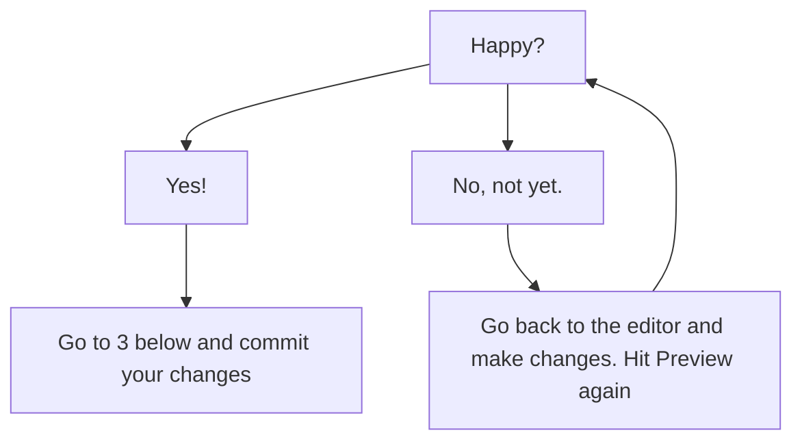

# Getting Started with Git + Markdown + VS Code

This is a brief guide to getting started with a workflow where we author markdown files using Visual Studio Code and store them in a git repository (repo) that lives on github.com. 

This document is meant to accompany in-class lectures and demonstrations, so does not contain full definitions of all of the terms incldued. If you're working along and need to reference notes, or search on the web for information, that is *highly* encouraged.

Finally, this document is written in **markdown** and available as part of our git repo, so can be used as a template or reference.

## Step 1 : Get setup with Github

The first thing you'll need is a [github.com](https://github.com) account. They are free for most uses! 

If you used your university e-mail account to create an account, you are also eligible to sign up for Github.com's education "Developer Pack," which gives you access to all kinds of useful tools, communities and information that would otherwise require a subscription. You will not _need_ these tools for this module, but might enjoy exploring them / take advantage of them anyway.

Once you have an account, you can start creating repositories.

### Create a New Repository
1. Navigate to the repository tab on the main github.com page.
2. Click the green "new repository button" on the right.
3. This will take you to a simple form to fill in with some information about your repository. _most of the defaults_ should be fine. But...
    * your repository needs a name
    * This first time through we are going to create a special repository that uses **the same name as your username** (in my case my username is "doctarr" so I will create a repository called "doctarr")
    * under **description** you can fill in a short description of the page, in this case, it will be something like "personal bio"
    * *THE MOST IMPORTANT PART* : You need to check to the "Add a README" box. This will create a readme.md file (md is MarkDown, remember) that we will then edit.
    * you shouldn't need a .gitignore for this repository or a license, but you're welcome to add either if you want to see what they do -- they wont' harm the project.
4. Click "Create Repository"

You're officially a computer programmer, welcome.

### Edit your readme.md
You can edit your readme.md directly on github.com. This is handy for quick updates, or edits, but our goal is to get comfortable working with git files on desktop software in a few moments.

**IMPORTANT** : This is a public page, do not put anything on here that you wouldn't want someone to find with google. This is a learning exercise, so you are free to be creative and make up a persona for yourself and/or create a real profile that you can use in the future. Whatever you're comfortable with, as long as you understand the markdown.

But first, let's try it out. You'll want to reference the [Markdown Cheat Sheet](https://www.markdownguide.org/cheat-sheet/) to remember what annotation does what:

1. Try adding a title header like "about me" like this:

    ``` 
    # About me 
        My name is Orlando. This is my first github page.
    ```
    
    Below that you can add a little more text, try out some other markdown:
    ```
    ## Interests
    I am a student and currently working on a couple of different areas of overlapping interest:
    - Time Travel
    - Gender and technologies
    - nonlinear storytelling
    ```
2. Above the text editor is a tab to preview what you've done. 

3. Commit Changes

    This is the most important git step. This is where you tell the git repository that you've made changes to a file that you want to keep. In the future, if you want to get back to these changes, or before them, you can. But also, anyone sharing the repository will receive the changes and the log of changes as well.
    * For our purposes right now, the default "update readme.md" is fine for a commit title, though in the future you might want to use something more specific, depending on your project. 
    * Under the extended description, you can say a little more about what you did. In this case, it may just be "I added some basic information to the page to test the readme.md." But in the future, these will be lengthier explanations for you and your collaborators to reference.
    * we only have one, main branch at this point, so commit to that. This is important for the special readme.md repo because it is used by github as your front page. Future projects will have many branches that you can use to develop work.

4. Checkout your new profile by clikcing on your username in the top left corner and returning to the main page.

That's it! You effectively have what you need to work directly with github. But loading webpages, checking previews, trying to edit multiple files at once... that is going to get complicated and slow. We need a proper code editor!
    
# Step 2 : Get Familiar with VS Code

Open Visual Studio Code on the comptuer, in whatever way is fasteset for you on the system you're on.

The interface will look *very slightly* different depending on what system you're on and which settings you've changed, but the basic layout at the start should be the same.

## The Main Editing Window(s)
VS Code is actually built with much of the same code that makes a web browser work, but a bit fancier. Why that matters here is that it uses windows with tabs, so you can have multiple files open and switch between them easily. 

It also has the ability to split the main window so you can see multiple files at the same time. We will use this in a minute to preview our markdown, but it can also be really helpful if you're doing something like building an app and want to see some html, javascript and CSS that all reference each other at the same time.

When you have a document open, you will note that it also numbers the lines. This is *very* helpful for a couple of purposes: First, keeping track of changes. So, for example, in the current version of this document, this paragraph is on line 82. If I make changes in the future, git will note which line was changed. Second, if you're working on coding, it is invaluable for debugging, or at least discussing code. You can say to someone you're working with "please add a new function at line 637" for example.

## The bottom status bar
The status bar at the bottom does a lot of different things that we don't need to worry about yet. And sometimes extensions will add things to the status bar. 

What is most useful to us right now is the line and column indicator, which lets us know where our cursor is in the document.

**The File Type** indicator is also one of the best things about VS Code, and simmilar programs that provide custom color formatting and code layout. For right now, it is helpful to tell VS Code that the file we are working with is Markdown, so it nows how to format the code as we type. As you work with more advanced coding languages, being able to have VS Code format for something like javascript or python makes working with those languages possible. 

## The Left Side Menu
This is similar to the ribbon on most Miscrosoft and similar applications, but is designed to be much more compact. Like the other areas, it has many features that we may not use until much later, or at all, but you should know a few:
### Explorer
This will show you all of the files in the folder you're working in. Essentail for project management.

### Search
This will help you find text in a document or documents. 

### Source Control
For us, this will be where we keep track of git changes, commits and push/pulls.

### Run and Debug
Not really useful for markdown, but great for interpreted languages.

### Extensions
This will show you all of the extensions already added to VS Code AND what can be added. In fact, let's do that now.


# Step 3 : Add some functionality to VS Code
There are more extensions for VS Code than you can imagine, literally thousands for each of the coding languages it works with. For our purposes today, we only need to add a few. 

Open the extension tab and search for, then add the following:
- [ ] github repositories
- [ ] github markdown
- [ ] Markdown Checkbox
- [ ] Markdown Preview Mermaid (we won't use this for a few weeks, but it will help you see some diagrams)

Note: most extensions simply install and operate automatically without having to restart the software. Very nice! Similarly, if something isn't working right, it can be disabled from this menu easily. 

# Step 4 : Put it all together

## Get some git

Let's start by pulling your readme.md from your github account.

1. Click on the source control icon on the right.
2. You now should have the option to **clone repository** click that button.
3. This will open a box in the top search bar with the option to "clone from github"
4. You will be asked to login.
5. Now you should see a list of your repositories. Select your username/username repo
6. Select the folder on your computer that you want to pull the repo to -- for most cases, a folder in the H drive works well at Newcastle.
7. You wlil be prompted to ask if you'd like to open the repo, say yes!

You now have a copy of your readme.md file on your computer. You can edit as you want.

## Preview your work in real time
With your readme.md file open, check a few things:
* In the bottom right status bar, does it read **markdown** ?
* In the source control window can you see changes and commit buttons? We will come back to those in a moment.

Now, look for an icon in the very top right of your window that looks like a square split in half with a magnifying glass. If you mouse over this, it will tell you the shortcut keys for preview. But you can also just click on it.

This should split your screen and show you what your markdown file will look like when rendered. You can't edit it directly, but try changing some of the markdown to see what happens.

__note: you can collapse the left hand menu to give yourself more screen space__

## Commit and push (sync)
Once you've made changes you like, reopen the source control menu.

1. Add a Message that explains the changes you've made.
2. Press the commit button.
